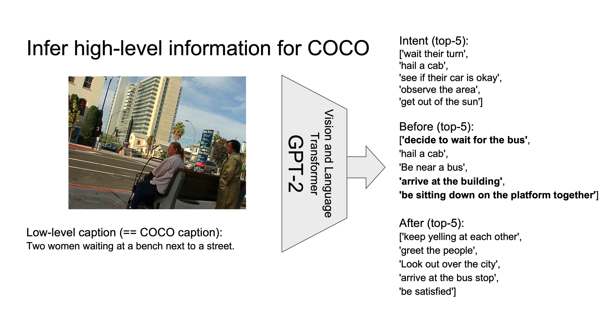
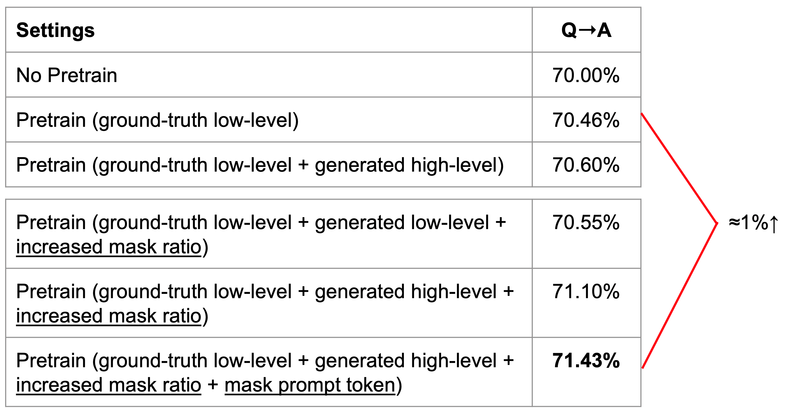

# Machine Commonsense (MCS) Phase 2

## High-level caption generation
We finetune a GPT2 model with the input of <image, low-level caption> pairs and the target output of high-level captions. Then we use the finetuned GPT2 model to generate high-level captions on VisualCOMET dataset and COCO dataset.

```
<image, low-level caption> ---[GPT2]--> high-level temporal caption

Finetune:
  a. image information is represented with feature vectors, one feature vector for each box
            15 ground truth boxes
            36/15 detected boxes by detectron2

Infer:
  a. VisualCOMET: <image, low-level caption> = <image, event>
  b. COCO: <image, low-level caption> = <image, COCOCaption>
    i) Append names to person nouns
```


## New pretraining strategies
We pretrain VLBERT with the generated high-level captions and see whether this pretraining strategies can improve VLBERT's performance on downstream tasks, such as VCR.
```
Pretrain VL-BERT
  a. First stage pretrain  (in-domain)  : COCO
    Compare the following 4 settings (event means ground truth COCO captions):
        no pretraining
        event
        event + oscar caption
        event + gpt temporal

  b. Second stage pretrain (out-domain) : VCR QAR, VisualCOMET
    Phase 2 focuses on 1st stage pretrain b/c 2nd stage pretrain will reduce the advantage of temporal caption pretrain
```

## Effectiveness of high-level captions (when compared with low-level captions)
We use Oscar to generate the same amount of low-level captions so that we can show that additional amount of high-level captions are more helpful for VLBERT pretraining than adding the same amount of low-level captions.
```
<image> ---[SOME TRANSFORMER]--> low-level caption
  a. [SOME TRANSFORMER] = Oscar
```

## Experiments
Pretrain with COCO


## Reference
```
https://github.com/jackroos/VL-BERT
https://github.com/jamespark3922/visual-comet

https://github.com/ruotianluo/self-critical.pytorch
https://github.com/aimagelab/meshed-memory-transformer
https://github.com/microsoft/Oscar
https://github.com/airsplay/py-bottom-up-attention
```
